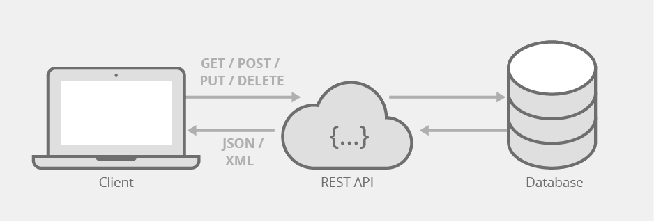

**REST API kurzus**

# Bevezetés a REST API-ba

## Mi az a REST API

A REST (Representational State Transfer) API egy olyan szoftverarchitektúra, amely lehetővé teszi a kliens és a szerver közötti kommunikációt a HTTP protokollon keresztül. A REST API-k az internetes alkalmazások közötti adatcserét teszik lehetővé, és alapvetően a kérések (HTTP kérések) és válaszok (HTTP válaszok) formájában működnek.

A REST API alapelvei Roy Fielding "A megosztott hipermediás reprezentációk elérésének állapotmentes modellje" című disszertációjából származnak, amelyet 2000-ben írt. Fielding ebben a disszertációban lefektette az ún. REST architektúrális stílusát, amely az internetes protokollok, különösen az HTTP számára alkalmas módot kínál a hálózaton elérhető információk megosztására.

A REST API-k előnyei közé tartozik a könnyű skálázhatóság, az egyszerűség, a platformfüggetlenség és a könnyű érthetőség. Ez a módszer nagyon elterjedt a webes alkalmazások fejlesztésében, és ma már számos olyan szolgáltatás, alkalmazás és webhely használja, amelyek lehetővé teszik a felhasználók számára a különböző adatok elérését és kezelését.




## Az API-ok szerepe a modern webfejlesztésben

Az API-k (alkalmazásprogramozási interfészek) nagyon fontos szerepet töltenek be a modern webfejlesztésben, és számos ok miatt alapvető fontosságúvá váltak:

1. **Modularitás és újrafelhasználhatóság**: Az API-k lehetővé teszik a funkcionalitások moduláris felépítését, így különböző alkalmazások könnyen újrahasznosíthatják ezeket a modulokat. Ezáltal időt és erőforrásokat lehet megtakarítani a fejlesztés során.
2. **Platformfüggetlenség**: Az API-k lehetővé teszik az alkalmazásoknak, hogy különböző platformokon (például webböngészők, mobilalkalmazások, szerverek stb.) működjenek anélkül, hogy szorosan összekapcsolódnának az adott platformmal. Ez a rugalmasság lehetővé teszi az alkalmazások számára, hogy többféle eszközön és platformon működjenek.
3. **Adatmegosztás és integráció**: Az API-k lehetővé teszik az adatok megosztását és integrálását más alkalmazásokkal vagy szolgáltatásokkal. Ez lehetővé teszi az alkalmazások közötti összekapcsolást és az adatok könnyű áramlását, ami gazdagabb felhasználói élményt eredményez.
4. **Közösségi fejlesztés**: Az API-k lehetővé teszik más fejlesztők számára, hogy alkalmazásokat és szolgáltatásokat építsenek a meglévő API-okra. Ez egy nyitott ökoszisztémát teremt, amelyben az innováció és a kreativitás virágozhat.
5. **Skálázhatóság**: Az API-k lehetővé teszik az alkalmazásoknak, hogy könnyen skálázhatóak legyenek a felhasználói igények növekedése esetén. Az új funkciók hozzáadása vagy a kapacitás növelése gyakran egyszerűen megvalósítható az API-k révén.

## Alapelvek és jellemzők

1. URL-ek (Uniform Resource Locator): Az erőforrásokat (adatokat, szolgáltatásokat stb.) egyedi URL-eken keresztül azonosítják. Ezek a URL-ek egyszerű és értelmezhető formátumban jelennek meg, és általában hierarchikusan szerveződnek.
2. HTTP metódusok: Az HTTP protokoll által definiált metódusokat (GET, POST, PUT, DELETE stb.) használják az adatok kezelésére és manipulálására az erőforrásokkal. Például a GET kérés az erőforrások lekérdezésére, a POST kérés az adatok létrehozására, a PUT kérés az adatok frissítésére és a DELETE kérés az adatok törlésére szolgál.
3. Állapotkódok (HTTP status codes): Az állapotkódokat az HTTP válaszok részeként küldik vissza, és információt nyújtanak a kliensnek az adott kérés eredményéről. Például a 200-as sorozat jelzi a sikeres kérést, a 400-as sorozat jelzi a kliens hibáját, míg a 500-as sorozat jelzi a szerver hibáját.
4. Állapotmentesség (Statelessness): A REST architektúra állapotmentes, ami azt jelenti, hogy minden egyes kérés kliens által hordozza az összes szükséges információt a szervernek a válasz megfelelő feldolgozásához. A szerver nem tárol semmilyen ügyfél-specifikus információt a kérések között.
5. Reprezentáció (Representation): Az adatokat általában különböző formátumokban (pl. JSON, XML, HTML stb.) reprezentálják, és a kliens kérése alapján a szerver válasza megfelelő formátumban jelenik meg.
6. Egyediség (Uniform Interface): A REST API-knak egységes interfészt kell biztosítaniuk az erőforrásokhoz való hozzáférésre és kezelésre. Ez magában foglalja az egységes URL-eket, az HTTP metódusok használatát, valamint a közvetlen és egyértelmű reprezentációt az erőforrások állapotáról.

# A Backend felépítése

## Környezet beállítása

1. XAMPP konfiguráció:

- Indítsa el a XAMPP vezérlőpaneljét.
- Ellenőrizze, hogy az Apache és a MySQL szerverek futnak-e. Ha nem, indítsa el őket a megfelelő gombokra kattintva.

1. Apache konfiguráció:

- Az Apache szerver beállításai alapvetően a "httpd.conf" fájlban találhatók. Ezt a fájlt általában a XAMPP telepítési könyvtárában (pl. C:\\xampp\\apache\\conf) találja meg.
- Nyissa meg a "httpd.conf" fájlt egy szövegszerkesztőben.
- Itt módosíthatja az Apache beállításait, például a portszámokat vagy a virtuális hosztokat, ha szükséges.

1. MySQL konfiguráció:

- A MySQL beállításai a "my.ini" fájlban találhatók. Ezt a fájlt általában a XAMPP telepítési könyvtárában (pl. C:\\xampp\\mysql\\bin) találja meg.
- Nyissa meg a "my.ini" fájlt egy szövegszerkesztőben.
- Itt módosíthatja a MySQL beállításait, például a portszámokat vagy a tárolási útvonalakat, ha szükséges.

1. PHP beállítása:

- A PHP beállításai a "php.ini" fájlban találhatók. Ezt a fájlt általában a XAMPP telepítési könyvtárában (pl. C:\\xampp\\php) találja meg.
- Nyissa meg a "php.ini" fájlt egy szövegszerkesztőben.
- Itt módosíthatja a PHP beállításait, például az adatbázis kapcsolódási paramétereket vagy a hibakeresési beállításokat, ha szükséges.

## MYSQL adatbázis létrehozása

1. Indítsa el a XAMPP vezérlőpaneljét, és győződjön meg róla, hogy a MySQL szerver fut.
2. Nyissa meg a böngészőjét, és látogasson el a <http://localhost/phpmyadmin> címre, hogy megnyissa a phpMyAdmin felhasználói felületet.
3. Jelentkezzen be a phpMyAdminba a felhasználónevével és jelszavával.
4. Kattintson az "Új létrehozása" gombra az adatbázis létrehozásához.
5. Adja meg az adatbázis nevét (pl. "mydatabase"), majd kattintson az "OK" gombra az adatbázis létrehozásához.
6. Opcionálisan hozzon létre táblákat az újonnan létrehozott adatbázisban a "Tábla létrehozása" menüpont segítségével.

## PHP backend kapcsolása az adatbázishoz
```php
<?php
    // Adatbázis kapcsolódási adatok
    $servername = "localhost";
    $username = "root"; // Alapértelmezett felhasználónév XAMPP esetén
    $password = ""; // Alapértelmezett jelszó XAMPP esetén
    $database = "mydatabase"; // Az ön adatbázisának neve

    // Kapcsolódás az adatbázishoz
    $conn = new mysqli($servername, $username, $password, $database);

    // Kapcsolódás ellenőrzése
    if ($conn->connect_error) {
        die("Sikertelen kapcsolódás az adatbázishoz: " . $conn->connect_error);
    } else {
        echo "Sikeres kapcsolódás az adatbázishoz!";
    }

    // Kapcsolat bezárása
    $conn->close();
?>
```
## Elérési pontok meghatározása
Az alkalmazásban az egyes erőforrásokhoz tartozó elérési pontokat kell meghatározni. Például:

GET /users: Az összes felhasználó lekérése.
GET /users/{id}: Egy adott felhasználó lekérése az azonosító alapján.
POST /users: Új felhasználó létrehozása.
PUT /users/{id}: Egy adott felhasználó frissítése az azonosító alapján.
DELETE /users/{id}: Egy adott felhasználó törlése az azonosító alapján.
## Kérések kezelése a backend oldalon:
Az egyes elérési pontokhoz tartozó kéréseket megfelelően kell kezelni a backend oldalon. Ez magában foglalja az adatok lekérdezését, frissítését, törlését stb. például adatbázisból vagy külső szolgáltatásokból.

## Paraméterek és adatok kezelése:
Az URL-ekben és a kérésekben található paramétereket (pl. azonosítók, szűrési feltételek stb.) és adatokat (pl. felhasználói adatok, beállítások stb.) megfelelően kell kezelni a backend oldalon.

## HTTP metódusok kezelése:
A különböző HTTP metódusokat (GET, POST, PUT, DELETE stb.) megfelelően kell kezelni az elérési pontokhoz tartozó műveletek szerint.

## Válaszok elküldése:
A backendnek megfelelő válaszokat kell küldenie a kérésekre, például JSON vagy XML formátumban az adatokkal és az állapotkóddal együtt.

```php
<?php
// Felhasználók lekérdezése
if ($_SERVER['REQUEST_METHOD'] === 'GET' && $_SERVER['REQUEST_URI'] === '/users') {
    // Felhasználók lekérése adatbázisból vagy más forrásból
    $users = fetchUsersFromDatabase();
    // Válasz küldése
    header('Content-Type: application/json');
    echo json_encode($users);
} elseif ($_SERVER['REQUEST_METHOD'] === 'POST' && $_SERVER['REQUEST_URI'] === '/users') {
    // Új felhasználó létrehozása
    $requestData = json_decode(file_get_contents('php://input'), true);
    // Felhasználó létrehozása az adatbázisban vagy más forrásban
    createUserInDatabase($requestData);
    // Sikeres válasz küldése
    http_response_code(201);
    echo json_encode(array("message" => "Felhasználó létrehozva"));
} elseif ($_SERVER['REQUEST_METHOD'] === 'GET' && preg_match('/\/users\/(\d+)/', $_SERVER['REQUEST_URI'], $matches)) {
    // Egy adott felhasználó lekérése
    $userId = $matches[1];
    // Felhasználó lekérése az adatbázisból vagy más forrásból
    $user = fetchUserByIdFromDatabase($userId);
    // Ha a felhasználó nem található, hibaüzenet küldése
    if (!$user) {
        http_response_code(404);
        echo json_encode(array("message" => "Felhasználó nem található"));
        exit();
    }
    // Válasz küldése
    header('Content-Type: application/json');
    echo json_encode($user);
}
// További elérési pontok kezelése...
?>

```