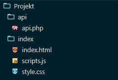

 # REST API kurzus
# Tartalomjegyzék
1. [Bevezetés a REST API-ba](#bevezetés-a-rest-api-ba)
   - [Mi az a REST API](#mi-az-a-rest-api)
   - [Az API-ok szerepe a modern webfejlesztésben](#az-api-ok-szerepe-a-modern-webfejlesztésben)
   - [Alapelvek és jellemzők](#alapelvek-és-jellemzők)
2. [A Backend felépítése](#a-backend-felépítése)
   - [Környezet beállítása](#környezet-beállítása)
   - [MYSQL adatbázis létrehozása](#mysql-adatbázis-létrehozása)
   - [PHP backend kapcsolása az adatbázishoz](#php-backend-kapcsolása-az-adatbázishoz)
   - [Elérési pontok meghatározása](#elérési-pontok-meghatározása)
   - [Kérések kezelése a backend oldalon](#kérések-kezelése-a-backend-oldalon)
   - [Paraméterek és adatok kezelése](#paraméterek-és-adatok-kezelése)
   - [HTTP metódusok kezelése](#http-metódusok-kezelése)
   - [Válaszok elküldése](#válaszok-elküldése)
3. [Frontend felépítése](#frontend-felépítése)
   - [A projekt inicializálása](#a-projekt-inicializálása)
   - [Kérések küldése az API-hoz](#kérések-küldése-az-api-hoz)
4. [Gyakorlati mintafeladat](#gyakorlati-mintafeladat)
   - [Egyszerű példa](#egyszerű-példa)
   - [Összetett példa](#összetett-példa)

# Bevezetés a REST API-ba

## Mi az a REST API

A REST (Representational State Transfer) API egy olyan szoftverarchitektúra, amely lehetővé teszi a kliens és a szerver közötti kommunikációt a HTTP protokollon keresztül. A REST API-k az internetes alkalmazások közötti adatcserét teszik lehetővé, és alapvetően a kérések (HTTP kérések) és válaszok (HTTP válaszok) formájában működnek.

A REST API alapelvei Roy Fielding "Architectural Styles and the Design of Network-based Software Architectures" című disszertációjából származnak, amelyet 2000-ben írt. Fielding ebben a disszertációban lefektette az ún. REST architektúrális stílusát, amely az internetes protokollok, különösen a HTTP számára alkalmas módot kínál a hálózaton elérhető információk megosztására.

A REST API-k előnyei közé tartozik a könnyű skálázhatóság, az egyszerűség, a platformfüggetlenség és a könnyű érthetőség. Ez a módszer nagyon elterjedt a webes alkalmazások fejlesztésében, és ma már számos olyan szolgáltatás, alkalmazás és webhely használja, amelyek lehetővé teszik a felhasználók számára a különböző adatok elérését és kezelését.


## Az API-ok szerepe a modern webfejlesztésben 

Az API-k (alkalmazásprogramozási interfészek) nagyon fontos szerepet töltenek be a modern webfejlesztésben, és számos ok miatt alapvető fontosságúvá váltak:

1. **Modularitás és újrafelhasználhatóság**: Az API-k lehetővé teszik a funkcionalitások moduláris felépítését, így különböző alkalmazások könnyen újrahasznosíthatják ezeket a modulokat. Ezáltal időt és erőforrásokat lehet megtakarítani a fejlesztés során.
2. **Platformfüggetlenség**: Az API-k lehetővé teszik az alkalmazásoknak, hogy különböző platformokon (például webböngészők, mobilalkalmazások, szerverek stb.) működjenek anélkül, hogy szorosan összekapcsolódnának az adott platformmal. Ez a rugalmasság lehetővé teszi az alkalmazások számára, hogy többféle eszközön és platformon működjenek.
3. **Adatmegosztás és integráció**: Az API-k lehetővé teszik az adatok megosztását és integrálását más alkalmazásokkal vagy szolgáltatásokkal. Ez lehetővé teszi az alkalmazások közötti összekapcsolást és az adatok könnyű áramlását, ami gazdagabb felhasználói élményt eredményez.
4. **Közösségi fejlesztés**: Az API-k lehetővé teszik más fejlesztők számára, hogy alkalmazásokat és szolgáltatásokat építsenek a meglévő API-okra. Ez egy nyitott ökoszisztémát teremt, amelyben az innováció és a kreativitás virágozhat.
5. **Skálázhatóság**: Az API-k lehetővé teszik az alkalmazásoknak, hogy könnyen skálázhatóak legyenek a felhasználói igények növekedése esetén. Az új funkciók hozzáadása vagy a kapacitás növelése gyakran egyszerűen megvalósítható az API-k révén.

## Alapelvek és jellemzők

1. URL-ek (Uniform Resource Locator): Az erőforrásokat (adatokat, szolgáltatásokat stb.) egyedi URL-eken keresztül azonosítják. Ezek a URL-ek egyszerű és értelmezhető formátumban jelennek meg, és általában hierarchikusan szerveződnek.
2. HTTP metódusok: Az HTTP protokoll által definiált metódusokat (GET, POST, PUT, DELETE stb.) használják az adatok kezelésére és manipulálására az erőforrásokkal. Például a GET kérés az erőforrások lekérdezésére, a POST kérés az adatok létrehozására, a PUT kérés az adatok frissítésére és a DELETE kérés az adatok törlésére szolgál.
3. Állapotkódok (HTTP status codes): Az állapotkódokat az HTTP válaszok részeként küldik vissza, és információt nyújtanak a kliensnek az adott kérés eredményéről. Például a 200-as sorozat jelzi a sikeres kérést, a 400-as sorozat jelzi a kliens hibáját, míg a 500-as sorozat jelzi a szerver hibáját.
4. Állapotmentesség (Statelessness): A REST architektúra állapotmentes, ami azt jelenti, hogy minden egyes kérés kliens által hordozza az összes szükséges információt a szervernek a válasz megfelelő feldolgozásához. A szerver nem tárol semmilyen ügyfél-specifikus információt a kérések között.
5. Reprezentáció (Representation): Az adatokat általában különböző formátumokban (pl. JSON, XML, HTML stb.) reprezentálják, és a kliens kérése alapján a szerver válasza megfelelő formátumban jelenik meg.
6. Egyediség (Uniform Interface): A REST API-knak egységes interfészt kell biztosítaniuk az erőforrásokhoz való hozzáférésre és kezelésre. Ez magában foglalja az egységes URL-eket, az HTTP metódusok használatát, valamint a közvetlen és egyértelmű reprezentációt az erőforrások állapotáról.

# A Backend felépítése

## Környezet beállítása

1. XAMPP konfiguráció:

   - Indítsa el a XAMPP vezérlőpaneljét.
   - Ellenőrizze, hogy az Apache és a MySQL szerverek futnak-e. Ha nem, indítsa el őket a megfelelő gombokra kattintva.

2. Apache konfiguráció:

   - Az Apache szerver beállításai alapvetően a "httpd.conf" fájlban találhatók. Ezt a fájlt általában a XAMPP telepítési könyvtárában (pl. C:\\xampp\\apache\\conf) találja meg.
   - Nyissa meg a "httpd.conf" fájlt egy szövegszerkesztőben.
   - Itt módosíthatja az Apache beállításait, például a portszámokat vagy a virtuális hosztokat, ha szükséges.


## MYSQL adatbázis létrehozása

1. Indítsa el a XAMPP vezérlőpaneljét, és győződjön meg róla, hogy a MySQL szerver fut.
2. Nyissa meg a böngészőjét, és látogasson el a <http://localhost/phpmyadmin> címre, hogy megnyissa a phpMyAdmin felhasználói felületet.
3. Kattintson az "Új létrehozása" gombra az adatbázis létrehozásához.
4. Adja meg az adatbázis nevét (pl. "mydatabase"), majd kattintson az "OK" gombra az adatbázis létrehozásához.
5. Hozzon létre táblákat az újonnan létrehozott adatbázisban a "Tábla létrehozása" menüpont segítségével.
6. Ha ki van választva az adatbázis, akkor az "Importálás" menüpontra kattintv importálhatóak a már meglévő táblák.

## PHP backend kapcsolása az adatbázishoz
```php
<?php
    // Adatbázis kapcsolódási adatok
    $servername = "localhost";
    $username = "root"; // Alapértelmezett felhasználónév XAMPP esetén
    $password = ""; // Alapértelmezett jelszó XAMPP esetén
    $database = "mydatabase"; // Az ön adatbázisának neve

    // Kapcsolódás az adatbázishoz
    $conn = new mysqli($servername, $username, $password, $database);

    // Kapcsolódás ellenőrzése
    if ($conn->connect_error) {
        die("Sikertelen kapcsolódás az adatbázishoz: " . $conn->connect_error);
    } else {
        echo "Sikeres kapcsolódás az adatbázishoz!";
    }

    //Függvények

    // Kapcsolat bezárása
    $conn->close();
?>
```
## Elérési pontok meghatározása
Az alkalmazásban az egyes erőforrásokhoz tartozó elérési pontokat kell meghatározni. Például:

GET /users: Az összes felhasználó lekérése. <br>
GET /users/{id}: Egy adott felhasználó lekérése az azonosító alapján.<br>
POST /users: Új felhasználó létrehozása.<br>
PUT /users/{id}: Egy adott felhasználó frissítése az azonosító alapján.<br>
DELETE /users/{id}: Egy adott felhasználó törlése az azonosító alapján.<br>
## Kérések kezelése a backend oldalon
Az egyes elérési pontokhoz tartozó kéréseket megfelelően kell kezelni a backend oldalon. Ez magában foglalja az adatok lekérdezését, frissítését, törlését stb. például adatbázisból vagy külső szolgáltatásokból.

## Paraméterek és adatok kezelése
Az URL-ekben és a kérésekben található paramétereket (pl. azonosítók, szűrési feltételek stb.) és adatokat (pl. felhasználói adatok, beállítások stb.) megfelelően kell kezelni a backend oldalon.

## HTTP metódusok kezelése
A különböző HTTP metódusokat (GET, POST, PUT, DELETE stb.) megfelelően kell kezelni az elérési pontokhoz tartozó műveletek szerint. <br>
Ezen metódusok kezelését php forrású backend-en egy if-es szerkezettel lehet megvalósítani.
 ```php 
 <?php
    if($_SERVER['REQUEST_METHOD'] == 'GET') { //ha 'get' metódust használunk
        //válasz lekérése és elküldése
    } elseif ($_SERVER['REQUEST_METHOD'] == 'POST'){ //ha 'POST' metódust használunk
        //elem létrehozása
    }elseif ($_SERVER['REQUEST_METHOD'] == 'PUT'){ //ha 'PUT' metódust használunk
        //elem frissítése
    }elseif ($_SERVER['REQUEST_METHOD'] == 'DELETE'){ //ha 'DELETE' metódust használunk
        //elem törlése
    }
 ?>
 ```


## Válaszok elküldése
A backendnek megfelelő válaszokat kell küldenie a kérésekre, például JSON vagy XML formátumban az adatokkal és az állapotkóddal együtt. <br>
A válaszokat a '*header()*', az állapotkódokat a '*http_response_code()*' php függvények segítségével tudjuk elküldeni.

```php 
    
    header('Content-Type: application/json'); // a header szintaxisa
    echo json_encode(['object_name' => $response_variable]); // a json típusú adattömböt egyszerűen kiirjuk

    //Státuszkód küldése:
    http_response_code(200); // OK
```

| Kód | Jelentés                         |
|-----|---------------------------------|
| 200 | OK                              |
| 201 | Created                         |
| 202 | Accepted                        |
| 203 | Non-Authoritative Information  |
| 204 | No Content                      |
| 301 | Moved Permanently               |
| 302 | Found                           |
| 304 | Not Modified                    |
| 400 | Bad Request                     |
| 401 | Unauthorized                    |
| 403 | Forbidden                       |
| 404 | Not Found                       |
| 500 | Internal Server Error           |
| 503 | Service Unavailable             |

# Frontend felépítése
## A projekt inicializálása
1. Először is, hozzuk létre a projekt mappáját, majd rendezzük el a szükséges fájlokat. Az álatlunk megírt API kódját érdemes elkülönítve tárolnunk. <br>
 <br>
2. Ha használni szeretnénk, készítsük el az adatbázist a phpMyadmin oldalon.
3. Az API fájlban írjuk meg a szükséges függvényeket.
4. Készítsük el a frontend kinézeti elemeit gombokkal, bemeneti mezőkkel.
5. Adjuk meg a frontend stílusát a styles.css fájlban.
## Kérések küldése az API-hoz
Az api-val való kommunikációt javascript fogja biztosítani.
1. A JavaScript fájlban írjuk meg a FETCH API függvényét
   ```javascript
   async function api() { 
        const response = await fetch("../api/api.php", {method: "GET"}); // használni kívánt metódus GET/POST/PUT/DELETE
        const data = await response.json(); // eltárolja a választ
        var válasz = data.value; // a 'value' helyére írjuk azt az objektumkulcsot amelyben a korábban megírt API-unk a megfelelő adatot tárolta
    }
   ```
2. Hívjuk meg a JavaScript függvényt az api használatához.
   ```html
    <input type="button" value="HTTP kérelem küldése" name="Button1" id="button1" onclick="api()">
   ```
3. Jelenítsük meg a JavaScriptben megkapott eredményt.


# Gyakorlati mintafeladat
## Egyszerű példa
Az első feladat egy egyszerű API megírása, ehhez adatbázist sem fogunk használni. A jelenlegi példában egy random jelszó generátort kell készíteni.
<br>
1. Hozzunk létre egy <i>"api"</i> nevű mappát és benne egy <i>"password.php"</i> nevű fájlt.
2. Írjunk egy egyszerű random jelszót generáló függvény és hívjuk meg.
```php
function generate_random_string($length = 12) {
        $characters = '0123456789abcdefghijklmnopqrstuvwxyzABCDEFGHIJKLMNOPQRSTUVWXYZ!?_-#&@';
        $random_string = '';
    
        for ($i = 0; $i < $length; $i++) {
            $random_string .= $characters[rand(0, strlen($characters) - 1)];
        }
    
        return $random_string;
    }
```
```php
if ($_SERVER['REQUEST_METHOD'] == 'GET') // lefut, ha a metódus GET
{
    $password = generate_random_string();
    header('Content-Type: application/json'); // a visszaadott érték json formátumú
    echo json_encode(['password' => $password]); // válasz (response)
}
```
3. Írjuk meg a REST API-t. A JavaScript fetch függvényét használva indíthatunk kérelmeket (HTTPRequest) és újratöltés nélkül változtathatjuk az oldalt.
```html
<!DOCTYPE html>
<html lang="hu">
<head>
    <meta charset="UTF-8">
    <meta http-equiv="X-UA-Compatible" content="IE=edge">
    <meta name="viewport" content="width=device-width, initial-scale=1.0">
    <title>Példa</title>
    <script>
    async function api() { // async, mert meg kell várnia, amíg a meghívott fájl lefut és visszaküldi a választ
        const response = await fetch("../api/password.php", {method: "GET"}); // meghívja az API-t GET metódussal
        const data = await response.json(); // eltárolja a választ
        document.getElementById('ujjelszo').innerText = data.password; // kiírja a kapott adatokból azt, ami kell
    }
    </script>
</head>
<body>
    <input type="button" value="Jelszó generálása" name="Jelszo" id="jelszo" onclick="api()">
    <p id="ujjelszo"></p>
</body>
</html>
```
Ha szükséges, a kész feladat megtalálható a kurzus mappájában.
## Összetett példa
Most, hogy az alapok megvannak, jöhet egy összetettebb feladat.<br>Egy könyvtárkezelő oldalt kell írni, amihez adatbázis is tartozik. 
<br>Funkciók:
- Könyvek állapotának és adatainak lekérdezése
- Könyvek hozzáadása
- Könyvek törlése
1. Első feladat az adatbázis létrehozása. A fenti leírás szerint csinálja végig az adatbázis létrehozását és adatok importálását.<br>
Az importálandó fájl itt található: 
[SQL](2.feladat/books.sql) (ha nem működik, megtalálja a kurzus mellett a mappában)
2. A kezelő API megírása minden metódusra.
